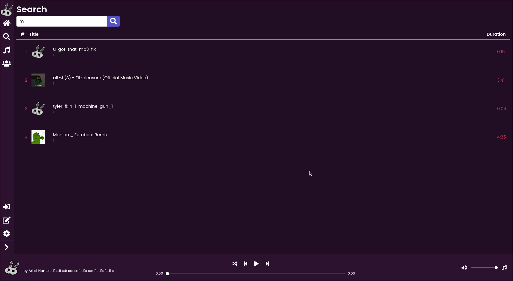

<h1 align="center"> <i><b> ~ BruhMusicTM ~ </i></b></h1>



# Installation
```
git clone https://github.com/Gaspard-Savoureux/BruhMusicTM.git 
&& cd BruhMusicTM 
&& npm install
```
# Pour démarrer
1. Premièrement, installer les dépendances: ```npm install``` </br>
2. Dans un premier terminal lancer: ```npm run watch``` pour compiler le code react <br/>
3. Dans un second terminal: ```npm start``` pour commencer l'application electron.
